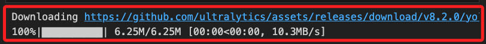

# YOLOv8（You Only Look Once version 8）

_以下講義是在 MacOS 上應用 YOLOv8_

<br>
## 準備工作

1. 安裝必要的依賴項，其中 `ultralytics` 是 YOLOv8 的官方 Python 套件；`opencv-python` 用於影像處理和影片讀取的 OpenCV 庫。

    ```bash
    pip install ultralytics opencv-python
    ```

<br>

2. 若出現套件衝突，可嘗試更新依賴套件進行排除。

    ```bash
    pip install --upgrade ultralytics numpy matplotlib opencv-python
    ```

<br>

3. 可手動下載 [YOLOv8 模型](https://huggingface.co/Ultralytics/YOLOv8/blob/main/yolov8n.pt)，或運行代碼自動下載；這個範例使用預訓練的 YOLOv8n 模型，這個小型模型適合快速實驗。

    

<br>

## 簡易物件偵測

1. 以下是使用 YOLOv8 進行即時物件偵測的程式碼。

    ```python
    # 導入必要的模組
    import cv2
    from ultralytics import YOLO
    import numpy as np

    # 初始化 YOLOv8 模型，這會自動下載並加載 YOLOv8n 模型
    model = YOLO('yolov8n.pt')

    # 設置影片來源，可以是攝像頭或影片文件
    # 設為 0 表示使用內建攝像頭
    # 或更改為 'video.mp4' 使用影片文件
    video_source = 0
    # 使用 `cv2.VideoCapture` 讀取影片，並使用 `cv2.imshow` 顯示每一幀
    cap = cv2.VideoCapture(video_source)

    # 檢查是否成功打開攝像頭或影片文件
    if not cap.isOpened():
        print("無法打開攝像頭或影片文件")
        exit()

    # 設定視窗大小
    window_name = "YOLOv8 Real-time Object Detection"
    cv2.namedWindow(window_name, cv2.WINDOW_NORMAL)
    cv2.resizeWindow(window_name, 800, 600)

    while True:
        # 讀取每一幀
        ret, frame = cap.read()
        if not ret:
            print("無法讀取幀或影片結束")
            break

        # 使用 YOLOv8 模型進行物件偵測
        results = model.predict(source=frame, show=False)

        # 解析 YOLOv8 的偵測結果
        for result in results:
            # 取得邊界框座標
            boxes = result.boxes.xyxy.cpu().numpy()
            # 取得置信度
            confidences = result.boxes.conf.cpu().numpy()
            # 取得類別索引
            class_ids = result.boxes.cls.cpu().numpy()

            for box, confidence, class_id in zip(
                boxes, confidences, class_ids
            ):
                # 取得邊界框的座標
                x1, y1, x2, y2 = map(int, box)
                # 取得物件類別名稱
                label = model.names[int(class_id)]

                # 繪製邊界框
                cv2.rectangle(
                    frame, (x1, y1), (x2, y2), (0, 255, 0), 2
                )
                # 繪製物件名稱及置信度
                cv2.putText(
                    frame, 
                    f'{label} {confidence:.2f}',
                    (x1, y1 - 10),
                    cv2.FONT_HERSHEY_SIMPLEX,
                    0.5,
                    (0, 255, 0),
                    2
                )

        # 顯示偵測結果影格
        cv2.imshow(window_name, frame)

        # 按下 'q' 鍵退出
        if cv2.waitKey(1) & 0xFF == ord('q'):
            break

    # 釋放資源
    cap.release()
    cv2.destroyAllWindows()
    ```

<br>

2. 根據應用場景選擇合適的 YOLOv8 模型，`yolov8n` 是最輕量的模型，適合快速實驗；如果需要更高的準確性，可以選擇 `yolov8m` 或 `yolov8l`。

<br>