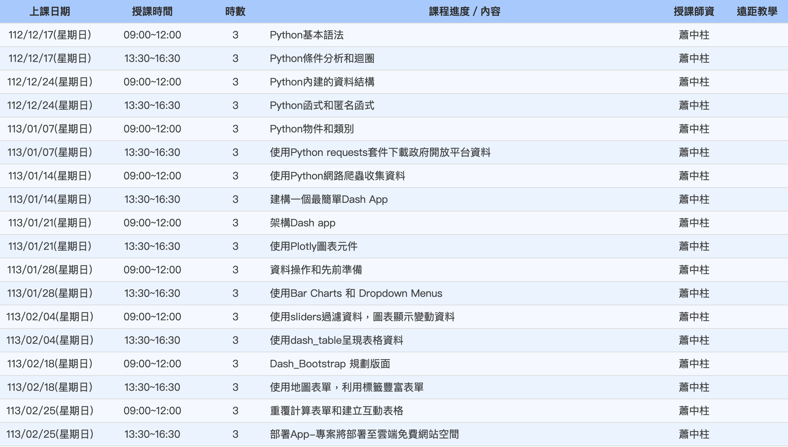

# 打造AI物聯網動態網頁圖表顯示平台實作班

## Python

## 爬蟲
- requests
- 政府開放平台資料
  
## AI

## IoT

## 動態網頁
- Boostrap
- Flask
- Dropdown Menu
- Sliders
- 地圖

## 資料庫
- Firebase

## 網站託管

## 圖表
- Dash App
- Dash Table
- Ploty
- Bar Charts

[官方課綱](https://ojt.wda.gov.tw/ClassSearch/Detail?PlanType=1&OCID=152463)

---

END